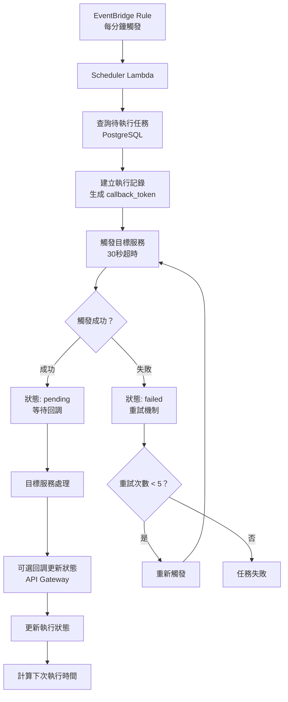

# Universal Task Scheduler

🚀 **基於 AWS Lambda 的通用任務排程觸發系統**

一個專注於排程觸發的 serverless 系統，負責在指定時間點精確觸發外部服務或 Lambda 函數。系統不執行具體的業務邏輯，而是作為一個可靠的時間觸發器，記錄觸發目標、攜帶參數資料，並追蹤觸發狀態。

## ✨ 核心特色

### 🎯 主要職責

- **⏰ 時間管理**：在指定時間點精確觸發事件
- **🎣 目標觸發**：觸發外部服務或 Lambda 函數（30 秒內等待回應）
- **📦 參數攜帶**：攜帶任務參數和回調 URL 給目標服務
- **📊 狀態管理**：管理觸發相關的基本狀態（供系統分析）
- **🔄 重試機制**：處理觸發失敗的重試邏輯（最多 5 次）
- **📞 回調機制**：提供回調機制供目標服務選擇性更新狀態

### 🎯 應用場景

- 🔔 定時觸發推播通知服務（LINE Bot、Email、SMS）
- 📈 定期觸發報表生成服務
- 🔄 定時觸發系統間資料同步服務
- 🔧 定期觸發維護和清理服務
- 💼 業務流程的定時自動化觸發

## 🏗️ 技術架構

### 核心技術棧

- **☁️ Runtime**: AWS Lambda + Node.js 22.x
- **💻 語言**: TypeScript
- **🗄️ 資料庫**: PostgreSQL (AWS RDS)
- **⏰ 排程器**: Amazon EventBridge
- **🌐 API**: AWS API Gateway
- **🔐 安全**: AWS IAM + Secrets Manager
- **📦 部署**: AWS SAM CLI

### 系統架構圖



## 🚀 快速開始

### 前置需求

- Node.js 22.14.0+
- AWS CLI 配置
- AWS SAM CLI
- PostgreSQL 資料庫

### 安裝步驟

1. **克隆專案**

```bash
git clone https://github.com/yourusername/universal-task-scheduler.git
cd universal-task-scheduler
```

2. **安裝依賴**

```bash
npm install
```

3. **設定環境變數**

```bash
cp .env.example .env
# 編輯 .env 檔案，設定資料庫連線等資訊
```

4. **資料庫初始化**

```bash
npm run db:migrate
```

5. **本地測試**

```bash
sam local start-api
```

6. **部署到 AWS**

```bash
sam build
sam deploy --guided
```

## 📋 排程類型支援

### 基本排程類型

- **即時執行** (`immediate`)：立即觸發
- **一次性** (`once`)：指定時間執行一次
- **每日** (`daily`)：每天固定時間執行
- **每週** (`weekly`)：每週固定時間執行
- **每月** (`monthly`)：每月固定日期執行
- **Cron 表達式** (`cron`)：自訂複雜排程

### 排程配置範例

```json
{
  "scheduleType": "daily",
  "scheduleConfig": {
    "time": "09:00",
    "description": "每天早上9點執行"
  }
}
```

```json
{
  "scheduleType": "cron",
  "scheduleConfig": {
    "cron": "0 9 1 * *",
    "description": "每月1號早上9點執行"
  }
}
```

## 🔧 API 使用範例

### 建立排程任務

```http
POST /schedule-task
Content-Type: application/json
Authorization: Bearer <API_KEY>

{
  "isRecurring": true,
  "scheduleType": "daily",
  "scheduleConfig": {
    "time": "09:00"
  },
  "taskConfig": {
    "taskType": "notification",
    "targetConfig": {
      "triggerType": "http",
      "url": "https://api.example.com/notify",
      "method": "POST"
    },
    "taskPayload": {
      "message": "每日提醒",
      "recipients": ["user@example.com"]
    }
  }
}
```

### 查詢任務執行歷史

```http
GET /task-history/{taskId}
Authorization: Bearer <API_KEY>
```

### 任務狀態回調

```http
PUT /task-callback/{callbackToken}
Content-Type: application/json

{
  "status": "success",
  "result": {
    "processedCount": 100,
    "executionTime": 3000
  }
}
```

## 📊 狀態管理

### 執行狀態

- **🕐 pending**: 已觸發，等待處理
- **⚡ processing**: 正在處理中
- **✅ success**: 執行成功
- **❌ failed**: 執行失敗
- **⏰ timeout**: 觸發超時
- **🚫 trigger_failed**: 觸發失敗

### 回調機制

- **彈性回調**：支援多次狀態更新
- **狀態轉換**：`pending → processing → success/failed`
- **跳躍狀態**：允許 `pending → success/failed`
- **終止回調**：達到最終狀態後拒絕回調

## 🗂️ 專案結構

```
├── src/                        # 源碼目錄
│   ├── executor.ts            # 任務執行 Lambda
│   ├── scheduler.ts           # 排程檢查 Lambda
│   ├── callback.ts            # 回調處理 Lambda
│   ├── types/                 # TypeScript 型別定義
│   ├── services/              # 服務層
│   ├── executors/             # 任務執行器
│   ├── models/                # 資料模型
│   └── utils/                 # 工具函數
├── database/                   # 資料庫相關
│   ├── migrations/            # 遷移腳本
│   └── seeds/                 # 測試資料
├── tests/                     # 測試檔案
├── docs/                      # 專案文件
├── template.yaml              # SAM 部署模板
├── tsconfig.json              # TypeScript 配置
└── package.json               # 依賴管理
```

## 🔐 安全性

- **🔑 認證**: API Gateway + API 金鑰
- **🛡️ 權限**: IAM 最小權限原則
- **🔒 加密**: HTTPS + 資料庫加密
- **🏪 金鑰管理**: AWS Secrets Manager
- **🔍 稽核**: CloudTrail 記錄

## 📈 監控與告警

### CloudWatch 監控指標

- Lambda 執行時間和錯誤率
- 任務觸發成功率
- 資料庫查詢效能
- API Gateway 使用量

### 建議告警設定

- Lambda 執行失敗率 > 5%
- 任務觸發延遲 > 2 分鐘
- 資料庫連線逾時

## 🤝 貢獻指南

1. Fork 此專案
2. 建立功能分支 (`git checkout -b feature/AmazingFeature`)
3. 提交變更 (`git commit -m 'Add some AmazingFeature'`)
4. 推送到分支 (`git push origin feature/AmazingFeature`)
5. 開啟 Pull Request

## 📝 變更日誌

詳見 [CHANGELOG.md](CHANGELOG.md)

## 📄 授權條款

此專案採用 MIT 授權條款 - 詳見 [LICENSE](LICENSE) 檔案

## 🔗 相關資源

- [AWS SAM CLI 文件](https://docs.aws.amazon.com/serverless-application-model/latest/developerguide/)
- [AWS Lambda 開發指南](https://docs.aws.amazon.com/lambda/latest/dg/)
- [TypeScript 官方文件](https://www.typescriptlang.org/docs/)
- [EventBridge 使用指南](https://docs.aws.amazon.com/eventbridge/latest/userguide/)

## 📞 支援與回饋

如有問題或建議，請：

- 🐛 [回報 Issue](https://github.com/yourusername/universal-task-scheduler/issues)
- 💡 [功能請求](https://github.com/yourusername/universal-task-scheduler/discussions)
- 📧 聯繫維護者：your.email@example.com

---

⭐ 如果這個專案對你有幫助，請給個 Star 支持一下！
