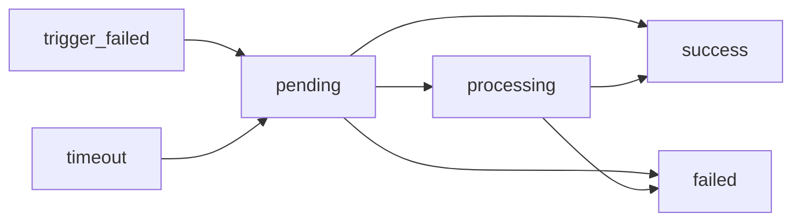

# Issue: 建立通用任務排程系統 Lambda 服務

## 需求描述

建立一個基於 AWS Lambda 的通用任務排程觸發器系統，專門負責在指定時間點觸發外部服務或 Lambda 函數。系統不執行具體的業務邏輯，而是作為一個可靠的時間觸發器，記錄觸發目標、攜帶參數資料，並追蹤觸發狀態。

## 專案目標

開發一個專注於排程觸發的系統，核心功能包括：

**主要職責：**

- **時間管理**：在指定的時間點精確觸發事件
- **目標觸發**：觸發外部服務或 Lambda 函數（30 秒內等待回應）
- **參數攜帶**：攜帶任務參數和回調 URL 給目標服務
- **簡單狀態管理**：管理觸發相關的基本狀態（供系統分析）
- **重試機制**：處理觸發失敗的重試邏輯（最多 5 次）
- **可選回調機制**：提供回調機制供目標服務選擇性更新狀態

**應用場景：**

- 定時觸發推播通知服務（LINE Bot、Email、SMS）
- 定期觸發報表生成服務
- 定時觸發系統間資料同步服務
- 定期觸發維護和清理服務
- 業務流程的定時自動化觸發

**系統邊界（不負責）：**

- ❌ 不執行具體業務邏輯（如發送郵件、生成報表等）
- ❌ 不主動查詢目標服務的詳細執行狀態
- ❌ 不管理目標服務的業務狀態（由目標服務自行定義）
- ❌ 不強制要求目標服務回調（回調是可選功能）
- ❌ 不保證回調狀態的權威性（僅供參考）

**當前版本限制：**

- 🔸 查詢配置 JSON 格式已支援多種查詢方式設計，但目前只實作 HTTP 查詢邏輯
- 🔸 Lambda、DynamoDB、SQS 等查詢方式的處理邏輯將在未來版本實作
- 🔸 當前對於非 HTTP 查詢類型會回傳「暫不支援」錯誤

**狀態管理分離：**

- **系統內部狀態**：用於觸發分析的簡單狀態管理
- **目標服務狀態**：由目標服務定義，終端應用可主動查詢

## 技術需求

### 1. 專案建立

- 使用 AWS SAM CLI 建立專案架構
- 使用 Node.js 22.14.0 runtime 搭配 TypeScript 開發
- 設定 TypeScript 編譯配置和型別定義
- 設定基本的 SAM template 配置
- 設計平台抽象化架構

### 2. Lambda 函數功能

#### 排程檢查 Lambda (Scheduler Lambda)

- 定期檢查資料庫中待執行的排程任務 (`next_execution_time <= 當前時間`)
- 根據排程條件判斷是否需要執行任務
- 建立任務執行歷史記錄，狀態設為 `pending`，生成 `callback_token`
- 觸發目標服務（Lambda 函數或外部 API），傳遞 `callback_token`
- 等待目標服務透過回調 API 更新執行狀態
- 計算並更新下次執行時間 (`next_execution_time`)
- 處理排程規則計算（daily, weekly, monthly, cron）

#### 任務觸發器 Lambda (Task Trigger Lambda)

- 接收 Scheduler Lambda 的觸發請求
- 支援多種觸發方式：
  - 調用其他 Lambda 函數
  - 發送 HTTP 請求到外部 API
  - 發布 SNS/SQS 訊息
  - 觸發 EventBridge 自訂事件
- 生成回調令牌 (callback token) 供目標服務使用
- 傳遞完整的任務參數和回調資訊
- 記錄觸發結果和錯誤資訊

#### 任務回調處理 Lambda (Task Callback Lambda)

- 處理目標服務的狀態回寫請求 (`PUT /task-callback/{token}`)
- 驗證回調令牌的有效性和授權
- 更新任務執行歷史的狀態 (`processing → success/failed`)
- 記錄目標服務提供的查詢配置 (query_config)
- 處理超時任務的重試邏輯
- 支援任務狀態追蹤和監控

### 3. EventBridge 排程觸發

- 設定 EventBridge 規則，每分鐘觸發排程檢查
- 支援複雜的週期性推播需求
- 觸發排程檢查 Lambda 進行任務掃描
- 提供可靠的定時觸發機制

### 4. API Gateway 設定

- 建立 REST API 或 HTTP API
- 設定資源和方法：
  - `POST /schedule-task`（建立排程任務）
  - `GET /task-history/{id}`（查詢歷史）
  - `PUT /task-callback/{callbackToken}`（任務狀態回寫）
- 整合 Lambda 函數
- 設定 CORS 政策
- 實作 API 金鑰認證
- 設定使用量計畫和限流

### 5. IAM 權限設定

- 建立 Lambda 執行角色
- 設定必要的 AWS 服務權限：
  - CloudWatch Logs 寫入權限
  - Secrets Manager 讀取權限（存取各平台 API 金鑰）
  - VPC 存取權限（存取 RDS）
  - RDS 連線權限
  - Lambda 調用權限（Scheduler Lambda 調用 Push Lambda）
  - AWS SES 發送權限（Email 推播）
  - AWS SNS 發送權限（SMS 推播）
- API Gateway 調用 Lambda 的權限
- EventBridge 觸發 Lambda 的權限
- 最小權限原則（Least Privilege）

### 6. PostgreSQL 資料庫設計

#### 資料庫架構

使用 AWS RDS PostgreSQL 建立推播管理資料庫，包含以下兩張表：

#### 排程任務主表 (scheduled_tasks)

```sql
CREATE TABLE scheduled_tasks (
    id SERIAL PRIMARY KEY,                          -- 主表ID
    task_name VARCHAR(255),                         -- 任務名稱
    task_description TEXT,                          -- 任務描述
    is_recurring BOOLEAN NOT NULL DEFAULT FALSE,    -- 是否是週期任務
    schedule_type VARCHAR(20) NOT NULL,             -- 排程週期（immediate, daily, weekly, monthly, cron）
    schedule_config JSONB,                          -- 複雜排程配置（如cron表達式、自訂規則）
    start_time TIMESTAMP,                           -- 週期起始時間
    end_time TIMESTAMP,                             -- 週期結束時間
    next_execution_time TIMESTAMP,                  -- 下次執行時間（用於排程檢查）
    task_type VARCHAR(50) NOT NULL,                 -- 任務類型（notification, report, sync, maintenance, business, custom）
    executor_config JSONB,                          -- 執行器配置
    task_payload JSONB NOT NULL,                    -- 任務負載資料（執行所需的所有參數）
    target_config JSONB NOT NULL,                   -- 目標服務配置（觸發方式、端點、參數等）
    trigger_timeout_seconds INTEGER DEFAULT 30,     -- 觸發請求超時時間（秒）
    retry_on_timeout BOOLEAN NOT NULL DEFAULT FALSE, -- 超時是否重試
    retry_config JSONB,                             -- 重試配置（次數、間隔等）
    is_finished BOOLEAN NOT NULL DEFAULT FALSE,     -- 是否結束
    is_active BOOLEAN NOT NULL DEFAULT TRUE,        -- 是否啟用（可暫停排程）
    created_at TIMESTAMP DEFAULT CURRENT_TIMESTAMP, -- 建立時間
    updated_at TIMESTAMP DEFAULT CURRENT_TIMESTAMP  -- 更新時間
);

-- 建立索引提升查詢效能
CREATE INDEX idx_scheduled_tasks_schedule ON scheduled_tasks(schedule_type, next_execution_time);
CREATE INDEX idx_scheduled_tasks_status ON scheduled_tasks(is_finished, is_active);
CREATE INDEX idx_scheduled_tasks_next_exec ON scheduled_tasks(next_execution_time) WHERE is_active = true AND is_finished = false;
CREATE INDEX idx_scheduled_tasks_type ON scheduled_tasks(task_type, created_at);
```

#### 任務執行歷史表 (task_execution_history)

```sql
CREATE TABLE task_execution_history (
    id UUID PRIMARY KEY DEFAULT gen_random_uuid(),                    -- 執行記錄唯一識別碼
    scheduled_task_id UUID NOT NULL REFERENCES scheduled_tasks(id) ON DELETE CASCADE, -- 關聯的排程任務ID
    cycle_number INTEGER NOT NULL,                                   -- 週期執行序號 (1=第一個週期, 2=第二個週期...)
    is_retry BOOLEAN NOT NULL DEFAULT FALSE,                         -- 是否為重試執行 (FALSE=首次執行, TRUE=重試)
    execution_started_at TIMESTAMP WITH TIME ZONE NOT NULL DEFAULT NOW(), -- 執行開始時間
    execution_completed_at TIMESTAMP WITH TIME ZONE,                 -- 執行完成時間
    trigger_status VARCHAR(20) NOT NULL,                            -- 觸發狀態 ('success', 'failed', 'timeout')
    trigger_result JSONB,                                           -- 觸發動作的回應結果 (Lambda回應、HTTP回應等)
    callback_token VARCHAR(255),                                    -- 回調Token (用於兩次回調驗證)
    execution_status VARCHAR(20) DEFAULT 'pending',                 -- 執行狀態 ('pending', 'processing', 'success', 'failed', 'timeout', 'trigger_failed') 觸發成功後為 pending，可透過回調更新
    query_config JSONB,                                             -- 查詢配置 (支援多種查詢方式：HTTP/Lambda/DynamoDB等，目前只實作HTTP查詢邏輯)
    created_at TIMESTAMP WITH TIME ZONE NOT NULL DEFAULT NOW(),     -- 記錄建立時間
    updated_at TIMESTAMP WITH TIME ZONE NOT NULL DEFAULT NOW()      -- 記錄最後更新時間
);

-- 建立索引
CREATE INDEX idx_task_execution_history_task ON task_execution_history(scheduled_task_id, execution_started_at);
CREATE INDEX idx_task_execution_history_status ON task_execution_history(execution_status, execution_started_at);
CREATE INDEX idx_task_execution_history_query_type ON task_execution_history USING GIN ((query_config->>'type'));
CREATE INDEX idx_task_execution_history_retry ON task_execution_history(scheduled_task_id, is_retry);
CREATE INDEX idx_task_execution_history_cycle ON task_execution_history(scheduled_task_id, cycle_number);
CREATE INDEX idx_task_execution_history_callback ON task_execution_history(callback_token) WHERE callback_token IS NOT NULL;
CREATE INDEX idx_task_execution_history_processing ON task_execution_history(execution_status, created_at) WHERE execution_status = 'processing';
```

#### 資料庫設計說明

**歷史表 (task_execution_history) 的執行記錄：**

- 每次觸發任務（包括首次執行和重試）都會建立一筆新記錄
- `cycle_number`: 記錄週期執行序號，同一週期內的重試使用相同編號
- `is_retry`: 區分是首次執行（FALSE）還是重試執行（TRUE）
- `trigger_result`: 記錄觸發動作的結果（Lambda 調用成功/失敗、HTTP 回應等）
- `query_config`: 記錄查詢配置 JSON（支援多種查詢方式如 HTTP/Lambda/DynamoDB 等，目前只實作 HTTP 查詢邏輯）

**執行流程範例：**

```
週期 1: cycle_number=1, is_retry=FALSE  (第1個週期首次執行)
週期 2: cycle_number=2, is_retry=FALSE  (第2個週期首次執行失敗)
週期 2: cycle_number=2, is_retry=TRUE   (第2個週期第一次重試)
週期 3: cycle_number=3, is_retry=FALSE  (第3個週期首次執行)
```

每次重試都會產生一筆新的任務歷史記錄，透過 `is_retry` 標記來區分是首次執行還是重試。

#### 執行狀態詳細說明

##### **pending** - 等待執行

**使用情境**：

- 任務已被排程檢查器發現並建立執行記錄
- 已觸發目標服務，等待目標服務確認開始處理
- 適用於所有需要回調機制的任務

**範例情境**：

```mermaid
flowchart TD
    A[EventBridge 觸發 Scheduler Lambda] --> B[Scheduler 查詢到需執行的任務]
    B --> C[建立 execution_history 記錄<br/>狀態設為 pending]
    C --> D[準備調用 Task Trigger Lambda]
```



**持續時間**：通常很短（數秒到數分鐘），取決於系統負載

##### **processing** - 執行中

**使用情境**：

- 目標服務已確認開始處理任務
- 需要外部服務進行兩次回調的所有任務
- 從 pending 狀態透過第一次回調轉換而來

**適用任務類型**：

- **報表生成**：處理大量資料
- **資料同步**：批次處理記錄
- **檔案處理**：大檔案上傳、轉換、分析
- **機器學習**：模型訓練或批次預測
- **系統備份**：完整資料庫備份操作

**狀態轉換流程**：



**回調機制**：

- **彈性回調**：開發者可自由決定回調次數，無上限限制
- **狀態轉換規則**：
  - 允許：`pending → processing/success/failed`、`processing → success/failed`
  - 禁止：狀態倒退（回應 400 Bad Request）
  - 重複：`processing → processing` 直接忽略（回應 200 OK）
- **終止回調**：達到 `success/failed` 後拒絕所有回調

##### **統一任務執行流程**

```mermaid
flowchart TD
    A[EventBridge 觸發] --> B[建立記錄 pending<br/>生成 callback_token]
    B --> C[觸發目標服務<br/>傳遞 callback_url + 30秒超時]
    C -->|200 OK 回應| D[狀態設為 pending<br/>觸發完成]
    C -->|非 200 回應| E[狀態設為 trigger_failed]
    C -->|30秒無回應| F[狀態設為 timeout]

    D --> G[目標服務自行處理任務]
    G --> H[目標服務可選擇性回調<br/>更新系統狀態]
    H --> I[終端應用可透過<br/>query_config 查詢詳細狀態]
```



⏰ **執行時間**：依任務複雜度而定，從分鐘到小時

- **pending**: 觸發成功，目標服務已接受任務（任務完成狀態）
- **processing**: 目標服務透過回調更新為處理中（可選）
- **success**: 目標服務透過回調更新為執行成功（可選）
- **failed**: 目標服務透過回調更新為執行失敗（可選）
- **timeout**: 觸發請求 30 秒內無回應
- **trigger_failed**: 觸發請求收到非 200 OK 回應

#### 狀態查詢機制

**查詢配置設計**：
系統使用 `query_config` JSONB 欄位儲存查詢配置，支援多種查詢方式的統一格式。

**當前支援的查詢方式（HTTP）**：

**查詢配置格式**：

```json
{
  "type": "http",
  "config": {
    "url": "https://api.service.com/tasks/abc123/status",
    "method": "GET",
    "headers": {
      "Authorization": "Bearer token",
      "Content-Type": "application/json"
    },
    "timeout": 10
  }
}
```

**未來支援的查詢方式（已預留結構）**：

**Lambda 函數查詢**：

```json
{
  "type": "lambda",
  "config": {
    "functionArn": "arn:aws:lambda:region:account:function:get-status",
    "payload": { "taskId": "abc123" },
    "timeout": 30
  }
}
```

**DynamoDB 查詢**：

```json
{
  "type": "dynamodb",
  "config": {
    "tableName": "task-status",
    "key": { "taskId": "abc123" },
    "projection": ["status", "progress", "details"]
  }
}
```

**查詢流程**：

1. 目標服務在觸發回應中提供 `query_config` JSON 配置
2. 終端應用解析配置並根據 `type` 執行對應的查詢邏輯
3. 目標服務負責維護和提供準確的狀態資訊

**HTTP 查詢回應格式範例**：

```json
{
  "status": "processing",
  "progress": 65,
  "progressMessage": "正在處理第 650 筆資料，共 1000 筆",
  "estimatedCompletion": "2025-01-15T14:30:00Z",
  "details": {
    "currentBatch": 7,
    "totalBatches": 10,
    "processedCount": 650,
    "errorCount": 2
  }
}
```

#### 資料庫連線設定

- 使用 AWS RDS PostgreSQL 實例
- 透過 VPC 私有子網路確保安全性
- 設定連線池管理（建議使用 `pg-pool` 或 `sequelize`）
- 資料庫憑證透過 AWS Secrets Manager 管理

### 7. 任務類型抽象化設計

#### 任務執行器接口設計

- 建立統一的任務執行器抽象層
- 支援插件式的任務處理器註冊
- 每個任務類型實作標準的執行接口
- 統一的錯誤處理和結果回應格式

#### 支援的任務類型

- **推播任務**: LINE、Email、SMS、Push Notification、Webhook
- **報表任務**: 月報表生成、數據分析、PDF 產生
- **資料同步任務**: 系統間資料同步、API 調用、檔案傳輸
- **維護任務**: 資料清理、備份操作、健康檢查
- **業務任務**: 拋單處理、狀態更新、通知發送
- **自訂任務**: 執行自訂 Lambda 函數或 HTTP 請求

### 8. 參數設計

#### 通用任務參數

- `taskType`: 任務類型 (`notification`, `report`, `sync`, `maintenance`, `business`, `custom`)
- `executorConfig`: 執行器配置（依任務類型而異）
- `taskPayload`: 任務負載資料（JSON 格式，包含執行所需的所有參數）
- `retryConfig`: 重試配置（次數、間隔、條件等）
- `metadata`: 任務特定的額外參數和標籤

### 9. 觸發方式詳細設計

#### 支援的觸發類型

**Lambda 函數觸發**

```json
{
  "triggerType": "lambda",
  "functionName": "target-function-name",
  "invocationType": "Event",
  "triggerTimeoutSeconds": 30
}
```

**HTTP API 觸發**

```json
{
  "triggerType": "http",
  "url": "https://api.example.com/webhook",
  "method": "POST",
  "headers": {
    "Authorization": "Bearer ${SECRET_TOKEN}",
    "Content-Type": "application/json"
  }
}
```

**SNS 訊息觸發**

```json
{
  "triggerType": "sns",
  "topicArn": "arn:aws:sns:region:account:topic-name",
  "messageAttributes": {
    "taskType": "notification"
  }
}
```

### 10. API 設計

#### 建立排程任務 API

```http
POST /schedule-task
Content-Type: application/json
Authorization: Bearer <API_KEY>

{
  "isRecurring": true,
  "scheduleType": "cron",
  "scheduleConfig": {
    "cron": "0 9 1 * *",
    "description": "每月1號早上9點生成月報表"
  },
  "startTime": "2025-10-03T00:00:00Z",
  "endTime": "2025-12-31T23:59:59Z",
  "taskConfig": {
    "taskType": "report",
    "targetConfig": {
      "triggerType": "lambda",
      "functionName": "monthly-report-generator",
      "triggerTimeoutSeconds": 30
    },
    "taskPayload": {
      "reportType": "monthly",
      "dateRange": "last_month",
      "departments": ["sales", "marketing"],
      "includeCharts": true,
      "outputFormat": "pdf",
      "recipients": ["manager@company.com"]
    },
    "retryConfig": {
      "retryOnTimeout": true,
      "maxRetries": 2,
      "retryIntervalMinutes": 30
    }
  }
}
```

#### 推播任務範例

```http
POST /schedule-task
Content-Type: application/json
Authorization: Bearer <API_KEY>

{
  "isRecurring": false,
  "scheduleType": "immediate",
  "taskConfig": {
    "taskType": "notification",
    "targetConfig": {
      "triggerType": "http",
      "url": "https://notification-service.company.com/api/send",
      "method": "POST",
      "headers": {
        "Authorization": "Bearer ${SECRET_NOTIFICATION_TOKEN}",
        "Content-Type": "application/json"
      }
    },
    "taskPayload": {
      "recipients": ["user@example.com"],
      "subject": "系統維護通知",
      "body": "系統將於今晚進行維護",
      "priority": "high"
    }
  }
}
```

#### 系統間拋單處理範例（需要回調的任務）

```http
POST /schedule-task
Content-Type: application/json
Authorization: Bearer <API_KEY>

{
  "isRecurring": true,
  "scheduleType": "daily",
  "scheduleConfig": {
    "time": "02:00",
    "description": "每日凌晨2點同步訂單資料"
  },
  "taskConfig": {
    "taskType": "sync",
    "executorConfig": {
      "sourceSystem": "order_system",
      "targetSystem": "erp_system",
      "syncMethod": "api",
      "isLongRunning": true,
      "triggerTimeoutSeconds": 30
    },
    "taskPayload": {
      "syncScope": "daily_orders",
      "batchSize": 100,
      "apiEndpoint": "https://erp.company.com/api/orders/batch",
      "callbackUrl": "https://scheduler-api.company.com/task-callback/{callback_token}"
    }
  }
}
```

**💡 觸發超時設定說明：**

本系統使用 30 秒觸發超時機制，設計原則：

- **快速失敗原則**：觸發請求必須在 30 秒內收到回應
- **責任分離**：系統只負責觸發，不等待業務邏輯完成
- **簡化設計**：避免長時間等待造成的複雜度

#### 需要回調的任務執行流程

1. **任務開始執行**

```json
{
  "executionId": "12345",
  "callbackToken": "abc123def456",
  "status": "processing",
  "startTime": "2025-10-02T02:00:00Z",
  "estimatedDuration": 3600,
  "callbackUrl": "https://scheduler-api.company.com/task-callback/abc123def456"
}
```

2. **進度回報**（可多次調用）

```json
{
  "status": "processing",
  "progress": 65,
  "progressMessage": "已處理 650 筆訂單，共 1000 筆",
  "currentBatch": 7,
  "totalBatches": 10,
  "errors": []
}
```

3. **任務完成**

```json
{
  "status": "success",
  "progress": 100,
  "progressMessage": "訂單同步完成",
  "result": {
    "totalProcessed": 1000,
    "successCount": 998,
    "errorCount": 2,
    "executionTime": 3245000
  }
}
```

#### 排程類型支援

```json
{
  "scheduleType": "immediate",     // 立即推播
  "scheduleType": "once",          // 一次性排程
  "scheduleConfig": {
    "executeAt": "2025-10-03T14:00:00Z"
  }
}

{
  "scheduleType": "daily",         // 每日推播
  "scheduleConfig": {
    "time": "09:00"                // 每天早上9點
  }
}

{
  "scheduleType": "weekly",        // 每週推播
  "scheduleConfig": {
    "dayOfWeek": 1,                // 週一 (0=週日, 1=週一...)
    "time": "09:00"
  }
}

{
  "scheduleType": "monthly",       // 每月推播
  "scheduleConfig": {
    "dayOfMonth": 1,               // 每月1號
    "time": "09:00"
  }
}

{
  "scheduleType": "cron",          // Cron 表達式排程
  "scheduleConfig": {
    "cron": "0 9 * * 1,3,5",      // Cron 表達式
    "description": "每週一、三、五早上9點"
  }
}
```

#### 查詢任務執行歷史 API

```http
GET /task-history/{taskId}
Authorization: Bearer <API_KEY>
```

#### 任務狀態回寫 API (彈性回調機制)

**回調 API 格式：**

```http
PUT /task-callback/{callbackToken}
Content-Type: application/json

{
  "status": "processing|success|failed"
}
```

**回調規則與回應：**

- **允許狀態轉換**: 200 OK
  - `pending → processing/success/failed`
  - `processing → success/failed`
- **重複狀態**: 200 OK (忽略處理)
  - `processing → processing`
- **禁止狀態轉換**: 400 Bad Request
  - 任何狀態倒退
  - 從最終狀態 (`success/failed`) 的任何轉換

**回調範例：**

```http
// 標準流程
PUT /task-callback/{token} {"status": "processing"}  // 200 OK
PUT /task-callback/{token} {"status": "success"}     // 200 OK

// 跳躍狀態
PUT /task-callback/{token} {"status": "success"}     // 200 OK (允許跳過 processing)

// 錯誤情況
PUT /task-callback/{token} {"status": "pending"}     // 400 Bad Request (狀態倒退)
```

## 任務執行流程詳解

### EventBridge + Lambda 架構流程

```mermaid
flowchart TD
    A[EventBridge Rule<br/>每分鐘觸發] --> B[Scheduler Lambda 函數]
    B --> C[查詢資料庫中<br/>next_execution_time <= 當前時間的任務]
    C --> D[根據 schedule_config<br/>判斷是否需要執行]
    D --> E[建立任務執行歷史記錄<br/>狀態: pending<br/>生成 callback_token]
    E --> F[觸發目標服務<br/>傳遞 callback_url<br/>30秒超時]
    F --> G{30秒內收到回應？}

    G -->|無回應| H[狀態設為 timeout]
    G -->|非200回應| I[狀態設為 trigger_failed]
    G -->|200 OK| J[狀態設為 pending<br/>觸發完成]

    J --> K[目標服務自行處理<br/>可選擇性回調更新狀態]

    H --> N{是否需要重試？}
    I --> N

    N -->|是<br/>最多5次| P[等待重試間隔後重新執行]
    N -->|否| Q[任務結束]

    P --> R[計算並更新下次執行時間]
    J --> R
    K --> R

    R --> S[根據 schedule_type 計算<br/>更新 scheduled_tasks 表]
    S --> T[完成本輪排程檢查]

    style H fill:#ffebee
    style I fill:#ffebee
    style Q fill:#ffebee
    style J fill:#e8f5e8
    style K fill:#fff3e0
```



### 任務執行狀態轉換圖

```mermaid
stateDiagram-v2
    [*] --> pending : 任務被排程檢查器發現<br/>建立執行記錄<br/>生成 callback_token

    pending --> processing : 彈性回調<br/>開始處理
    pending --> success : 彈性回調<br/>跳躍狀態完成
    pending --> failed : 彈性回調<br/>跳躍狀態失敗

    [*] --> trigger_failed : 觸發目標服務失敗
    [*] --> timeout : 觸發器30秒超時

    processing --> success : 彈性回調<br/>執行成功
    processing --> failed : 彈性回調<br/>執行失敗
    processing --> processing : 重複狀態回調<br/>直接忽略

    success --> [*]
    failed --> pending : 重試機制
    failed --> [*] : 超過重試次數
    timeout --> pending : 重試機制
    timeout --> [*] : 不重試或超過次數
    trigger_failed --> pending : 重試機制
    trigger_failed --> [*] : 超過重試次數

    note right of pending
        觸發完成狀態
        - 已成功觸發目標服務
        - 目標服務可選擇性回調更新狀態
    end note

    note right of processing
        處理中狀態（可選）
        - 目標服務回調確認處理中
        - 可接受後續回調更新
    end note

    note right of trigger_failed
        觸發失敗
        - 無法調用目標服務
        - 適用重試機制
    end note
```



### 狀態轉換時機說明

**任務建立 (→ Pending)**

- 觸發時機：Scheduler Lambda 發現需要執行的任務
- 操作者：Scheduler Lambda
- 同時動作：建立執行記錄、生成 callback_token、觸發目標服務

**觸發成功分支**

**→ pending**: 觸發成功，任務完成（目標服務可選擇性回調更新狀態）

**觸發失敗分支**

**→ trigger_failed**: 無法觸發目標服務（HTTP 錯誤、Lambda 不存在等）

**彈性回調機制**

**標準流程**：

- `pending → processing`：開始處理
- `processing → success/failed`：完成處理

**跳躍狀態**：

- `pending → success/failed`：直接完成（允許但可能觸發超時）

**錯誤處理**：

- **狀態倒退**：400 Bad Request
- **重複狀態**：200 OK（忽略）
- **最終狀態後回調**：400 Bad Request

**超時與重試機制**

- **超時檢測**：觸發請求 30 秒無回應後標記為 `timeout`
- **重試適用**：`trigger_failed`、`failed`、`timeout` 都適用重試
- **重試邏輯**：檢查 `retry_config` 配置，重新執行完整流程

**⚠️ 重要：觸發超時原則**

- **30 秒觸發超時**：確保目標服務能快速回應接收請求
- **責任分離**：系統只負責觸發，不管理業務邏輯執行時間
- **設定過短的風險**：任務仍在正常處理中就被標記為超時，導致錯誤的重試
- **設定建議**：
  - 快速任務（如發送通知）：5-10 分鐘
  - 一般處理任務：30-60 分鐘
  - 重度處理任務（如大型報表）：2-4 小時
- **動態評估**：根據目標服務的歷史執行時間調整超時設定
- 狀態保持：永久停留在 processing 狀態
- 適用情境：只需確保觸發成功，不關心執行結果的任務

## 實作步驟

### Phase 1: 專案初始化

- [ ] 安裝 AWS SAM CLI
- [ ] 使用 `sam init` 建立 Node.js 22.x 專案
- [ ] 確保本地 Node.js 版本為 22.14.0
- [ ] 設定 TypeScript 開發環境
- [ ] 安裝必要的依賴套件：
  - `typescript`
  - `@types/node`（v22.x 相容版本）
  - `@types/aws-lambda`
  - `axios`（HTTP 請求客戶端）
  - `pg`（PostgreSQL 客戶端）
  - `@types/pg`（PostgreSQL TypeScript 型別）
  - `aws-sdk`（AWS 服務整合）
- [ ] 設定 `tsconfig.json` 編譯配置
- [ ] 設計平台抽象化接口架構
- [ ] 建立專案資料夾結構

### Phase 2: 資料庫設定

- [ ] 使用 SAM template 建立 AWS RDS PostgreSQL 實例
- [ ] 設定 VPC、子網路和安全群組
- [ ] 建立資料庫 schema：
  - `scheduled_tasks` 主表
  - `task_execution_history` 歷史表
- [ ] 設定資料庫連線配置
- [ ] 建立資料庫遷移腳本（DDL）
- [ ] 測試資料庫連線

### Phase 3: IAM 和權限設定

- [ ] 建立 Lambda 執行角色
- [ ] 設定 CloudWatch Logs 權限
- [ ] 設定 Secrets Manager 存取權限（LINE Token + DB 憑證）
- [ ] 設定 VPC 和 RDS 存取權限
- [ ] 建立 API Gateway 權限政策
- [ ] 驗證最小權限原則

### Phase 4: API Gateway 設定

- [ ] 建立 REST API 或 HTTP API
- [ ] 設定資源和方法：
  - `POST /schedule-task`（建立排程任務）
  - `GET /task-history/{id}`（查詢歷史）
  - `PUT /task-callback/{callbackToken}`（任務狀態回寫）
- [ ] 整合 Lambda 函數
- [ ] 設定 CORS 政策
- [ ] 實作 API 金鑰認證
- [ ] 設定使用量計畫和限流

### Phase 5: EventBridge 排程設定

- [ ] 建立 EventBridge 規則（每分鐘觸發）
- [ ] 設定 EventBridge 觸發 Scheduler Lambda 權限
- [ ] 測試 EventBridge 觸發機制
- [ ] 驗證排程觸發的穩定性

### Phase 6: Lambda 函數開發（TypeScript）

#### 任務執行 Lambda (executor.ts)

- [ ] 定義 TypeScript 介面和型別：
  - API Gateway 事件型別
  - 資料庫實體型別（ScheduledTask, ExecutionHistory）
  - 任務執行器通用介面型別
  - 回應格式型別
- [ ] 實作任務執行器抽象化：
  - 建立基礎任務執行器接口
  - 實作執行器工廠模式
  - 建立執行器註冊機制
- [ ] 實作資料庫服務層：
  - PostgreSQL 連線管理
  - 任務 CRUD 操作
  - 執行歷史記錄功能
- [ ] 實作任務執行模式判斷：
  - 不需回調任務直接執行
  - 需要回調任務生成回調令牌
  - 兩次回調機制狀態管理
- [ ] 實作通用任務路由邏輯
- [ ] 設定環境變數和 Secrets Manager 整合
- [ ] 實作參數驗證和請求解析
- [ ] 加入型別安全的錯誤處理和重試機制
- [ ] 實作 API Gateway 事件處理器

#### 任務回調處理 Lambda (callback.ts)

- [ ] 實作回調令牌驗證機制
- [ ] 處理任務狀態更新請求：
  - 第一次回調：pending → processing 狀態更新
  - 第二次回調：processing → success/failed 最終狀態處理
  - 查詢配置 (query_config) 記錄和時間戳更新
- [ ] 實作任務完成後處理邏輯
- [ ] 加入回調安全性驗證
- [ ] 處理逾時任務的自動標記
- [ ] 實作任務監控和告警機制

#### 排程檢查 Lambda (scheduler.ts)

- [ ] 實作排程掃描邏輯：
  - 查詢待執行的排程任務
  - 解析各種排程類型（daily, weekly, monthly, cron）
  - Cron 表達式解析和計算
- [ ] 實作 Lambda 調用功能：
  - 調用任務執行 Lambda
  - 處理調用結果和錯誤
- [ ] 實作下次執行時間計算
- [ ] 加入排程執行日誌記錄
- [ ] 編寫單元測試（Jest + TypeScript）

### Phase 7: 部署和測試

- [ ] 設定 SAM template.yaml（包含 esbuild 編譯設定）
- [ ] 編譯 TypeScript 程式碼 (`npm run build`)
- [ ] 本地測試 (`sam local start-api`)
- [ ] 部署到 AWS (`sam deploy`)
- [ ] API Gateway 端點測試
- [ ] 完整的推播功能測試
- [ ] 執行 TypeScript 單元測試

### Phase 8: 文件和優化

- [ ] 撰寫使用說明文件
- [ ] 加入監控和日誌
- [ ] 效能優化

## 專案結構

```
├── src/
│   ├── executor.ts              # 任務執行 Lambda 主函數
│   ├── scheduler.ts             # 排程檢查 Lambda 主函數
│   ├── callback.ts              # 任務回調處理 Lambda 主函數
│   ├── types/                   # TypeScript 型別定義
│   │   ├── api.ts              # API Gateway 事件型別
│   │   ├── database.ts         # 資料庫實體型別
│   │   ├── scheduler.ts        # 排程相關型別
│   │   ├── tasks.ts            # 任務相關型別
│   │   ├── executors.ts        # 執行器相關型別
│   │   └── callback.ts         # 回調相關型別
│   ├── services/               # 服務層
│   │   ├── databaseService.ts  # PostgreSQL 資料庫服務
│   │   ├── taskService.ts      # 任務核心服務
│   │   ├── schedulerService.ts # 排程邏輯服務
│   │   ├── callbackService.ts  # 回調處理服務
│   │   └── secretsService.ts   # AWS Secrets Manager 整合
│   ├── executors/              # 任務執行器實作
│   │   ├── base/               # 基礎抽象類別
│   │   │   └── baseExecutor.ts # 任務執行器基礎接口
│   │   ├── notification/       # 推播任務執行器
│   │   ├── report/             # 報表任務執行器
│   │   ├── sync/               # 同步任務執行器
│   │   ├── maintenance/        # 維護任務執行器
│   │   ├── business/           # 業務任務執行器
│   │   ├── custom/             # 自訂任務執行器
│   │   └── executorFactory.ts # 執行器工廠類別
│   ├── models/                 # 資料模型
│   │   ├── scheduledTask.ts    # 排程任務主表模型
│   │   └── executionHistory.ts # 執行歷史表模型
│   └── utils/                  # 工具函數
│       ├── validator.ts        # 參數驗證
│       ├── dbConnection.ts     # 資料庫連線管理
│       ├── cronParser.ts       # Cron 表達式解析
│       ├── lambdaInvoker.ts    # Lambda 調用工具
│       ├── retryHandler.ts     # 重試處理工具
│       ├── callbackToken.ts    # 回調令牌生成和驗證
│       └── response.ts         # API 回應格式化
├── database/                   # 資料庫相關檔案
│   ├── migrations/             # 資料庫遷移腳本
│   │   └── 001_initial.sql    # 建立初始表格
│   └── seeds/                  # 測試資料
├── tests/                      # 單元測試
│   ├── push.test.ts           # 推播函數測試
│   ├── scheduler.test.ts      # 排程函數測試
│   └── integration/           # 整合測試
├── dist/                       # 編譯後的 JavaScript
├── template.yaml              # SAM 部署模板
├── tsconfig.json              # TypeScript 配置
├── package.json               # Node.js 依賴管理
└── README.md                  # 專案說明文件
```

## 成功標準

1. 排程系統能成功支援多種任務類型（推播、報表、同步、維護、業務任務）
2. 具備完整的錯誤處理和重試機制
3. 支援複雜的排程功能（即時、週期性、自訂 Cron 表達式）
4. 執行器抽象化設計，易於擴展新的任務類型
5. 部署流程簡單且可重複執行
6. 有完整的 API 文件和使用範例
7. 任務執行歷史完整記錄和查詢功能
8. 支援任務的暫停、恢復、取消操作
9. 提供任務執行監控和告警功能

## 技術考量

### 安全性

- 任務執行憑證透過 AWS Secrets Manager 管理
- 實作適當的輸入驗證和 SQL 注入防護
- API Gateway 使用 API 金鑰或 JWT Token 認證
- 設定 CORS 政策限制來源網域
- 實作 API 呼叫頻率限制（Throttling）
- 使用 HTTPS 強制加密傳輸

### IAM 安全最佳實務

- 遵循最小權限原則
- 定期檢視和輪換存取金鑰
- 使用 IAM 角色而非用戶憑證
- 啟用 CloudTrail 記錄 API 呼叫

### API Gateway 安全設定

- 啟用 WAF（Web Application Firewall）
- 設定使用量計畫和配額
- 實作請求驗證（Request Validation）
- 加入自訂授權程式（Custom Authorizer）

### 效能

- 優化 cold start 時間
- 實作連線池重用
- 設定適當的 timeout 和 memory 配置

### 監控

- 整合 CloudWatch 監控
- 設定 Lambda 函數的 metrics 和 alerts
- 加入結構化日誌記錄

## TypeScript 開發配置

### package.json 依賴項目

```json
{
  "name": "universal-task-scheduler",
  "version": "1.0.0",
  "engines": {
    "node": ">=22.14.0"
  },
  "dependencies": {
    "aws-sdk": "^2.1490.0",
    "axios": "^1.5.0",
    "pg": "^8.11.0",
    "pg-pool": "^3.6.0"
  },
  "devDependencies": {
    "@types/aws-lambda": "^8.10.0",
    "@types/node": "^22.0.0",
    "@types/pg": "^8.10.0",
    "typescript": "^5.0.0",
    "jest": "^29.0.0",
    "@types/jest": "^29.0.0",
    "ts-jest": "^29.0.0",
    "esbuild": "^0.19.0",
    "eslint": "^8.0.0",
    "@typescript-eslint/eslint-plugin": "^6.0.0",
    "@typescript-eslint/parser": "^6.0.0"
  },
  "scripts": {
    "build": "tsc",
    "test": "jest",
    "lint": "eslint src/**/*.ts",
    "db:migrate": "psql -h $DB_HOST -U $DB_USER -d $DB_NAME -f database/migrations/001_initial.sql"
  }
}
```

### tsconfig.json 設定

```json
{
  "compilerOptions": {
    "target": "ES2022",
    "module": "commonjs",
    "lib": ["ES2022"],
    "outDir": "./dist",
    "rootDir": "./src",
    "strict": true,
    "esModuleInterop": true,
    "skipLibCheck": true,
    "forceConsistentCasingInFileNames": true,
    "resolveJsonModule": true,
    "moduleResolution": "node",
    "allowSyntheticDefaultImports": true
  },
  "include": ["src/**/*"],
  "exclude": ["node_modules", "dist", "tests"]
}
```

## 相關資源

- [AWS SAM CLI 文件](https://docs.aws.amazon.com/serverless-application-model/latest/developerguide/serverless-sam-cli-command-reference.html)
- [AWS Lambda Node.js 開發指南](https://docs.aws.amazon.com/lambda/latest/dg/lambda-nodejs.html)
- [TypeScript 官方文件](https://www.typescriptlang.org/docs/)
- [AWS Lambda TypeScript 最佳實務](https://docs.aws.amazon.com/lambda/latest/dg/typescript-handler.html)
- [API Gateway REST API 文件](https://docs.aws.amazon.com/apigateway/latest/developerguide/welcome.html)
- [IAM 最佳實務指南](https://docs.aws.amazon.com/IAM/latest/UserGuide/best-practices.html)
- [AWS Secrets Manager 文件](https://docs.aws.amazon.com/secretsmanager/latest/userguide/intro.html)
- [AWS SES API 文件](https://docs.aws.amazon.com/ses/latest/APIReference/Welcome.html)
- [AWS SNS API 文件](https://docs.aws.amazon.com/sns/latest/api/welcome.html)
- [EventBridge 文件](https://docs.aws.amazon.com/eventbridge/latest/userguide/eb-what-is.html)
- [Cron 表達式參考](https://docs.aws.amazon.com/AmazonCloudWatch/latest/events/ScheduledEvents.html)

## 預期時程

- Phase 1（專案初始化）: 1 天
- Phase 2（資料庫設定）: 2-3 天
- Phase 3（IAM 和權限設定）: 1 天
- Phase 4（API Gateway 設定）: 1-2 天
- Phase 5（EventBridge 排程設定）: 1 天
- Phase 6（Lambda 函數開發）: 6-8 天
- Phase 7（部署和測試）: 3-4 天
- Phase 8（文件和優化）: 1 天

**總計預估時程：16-22 天**

## 未來擴充規劃

### Phase 2: 多元狀態查詢方式支援

當前系統僅支援 HTTP URL 查詢方式，未來將擴充支援以下查詢機制：

- **Lambda 函數查詢**：透過 Lambda ARN 進行狀態查詢
- **DynamoDB 查詢**：直接查詢 DynamoDB 表格獲取狀態
- **SQS 訊息查詢**：透過 SQS 訊息 ID 查詢處理狀態
- **S3 檔案查詢**：查詢 S3 存儲的執行結果檔案
- **EventBridge 事件查詢**：透過事件溯源機制查詢狀態

**技術設計方向**：

- 將 `query_url` 欄位擴充為 `query_config JSONB`
- 支援多種查詢配置格式
- 提供統一的查詢介面抽象層

**相關 Issue**：詳見 `issue-query-methods-extension.md`

---

**建立日期：** 2025 年 10 月 2 日  
**狀態：** 待開始  
**優先級：** 高
